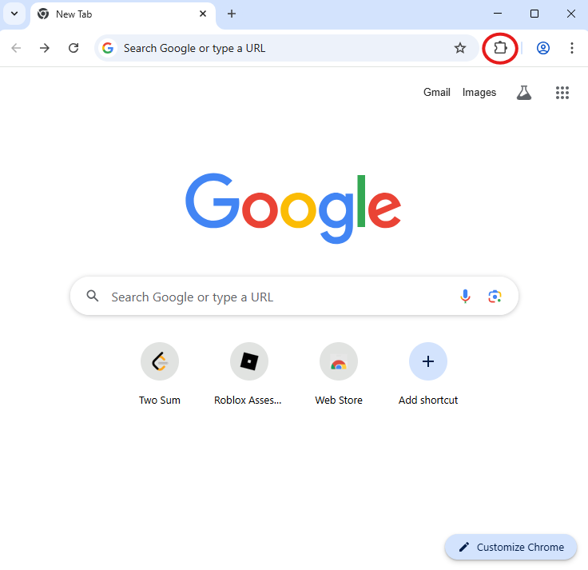
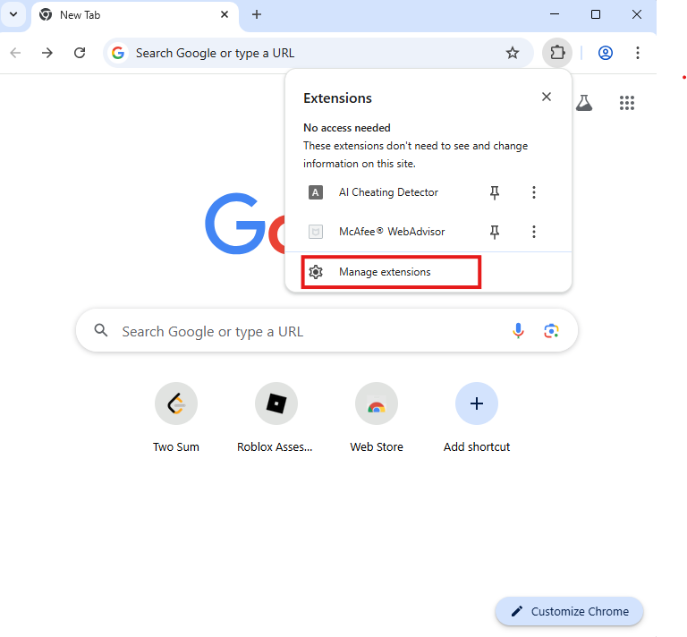
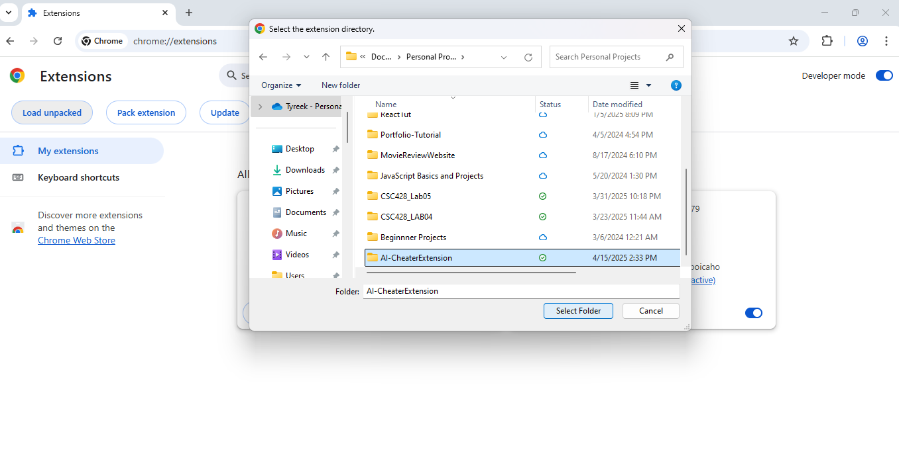

# AI-Cheater Extension

    This is an extension that checks for cheating via AI when completing leetcode style problems. The extension test for keystorke speed, code pasting, idle time, and tab switches. It will also show the timestamp that each event happen and the name of the problem they completed. The user will be able to clear all data to recheck user's problem performance again. Finally, the user will be able to export data to a csv file once it is all collected.

## Languages

- HTML
- JavaScript

## Installation

1. Clone Respository:

```bash
git clone https://github.com/TonytheAlias/AI-CheaterExtension
```

2.  Installation:

Compatible with Google Chrome and Microsoft Edge

- Chrome Installation: [Mac & Windows Install ](https://www.google.com/chrome/bsem/download/en_us/?brand=RXQR&ds_kid=43700081553519990&&utm_source=bing&utm_medium=cpc&utm_campaign=1709650%20%7C%20Chrome%20Win11%20%7C%20DR%20%7C%20ESS01%20%7C%20NA%20%7C%20US%20%7C%20en%20%7C%20Desk%20%7C%20SEM%20%7C%20BKWS%20-%20EXA%20%7C%20Txt%20%7C%20Bing&utm_term=chrome%20download&utm_content=Desk%20%7C%20BKWS%20-%20EXA%20%7C%20Txt_Chrome&gclid=0f97634be48f1408a36004b55d76fe8f&gclsrc=3p.ds&gad_source=7)

3. Open Chrome browser once installed

4. Click on the puzzle piece icon at the right-end outside of your url bar. Then click manage extentions.
   
   

5. Then click Load unpack and find the folder that contains the folder of the AI-Cheater Extension. <br>
   

## Usage

- The Extension currently only works on leetcode.com and neetcode.io

- Try to solve a problem on either leetcode or neetcode, then click on the extension to see results or export results to a csv.
